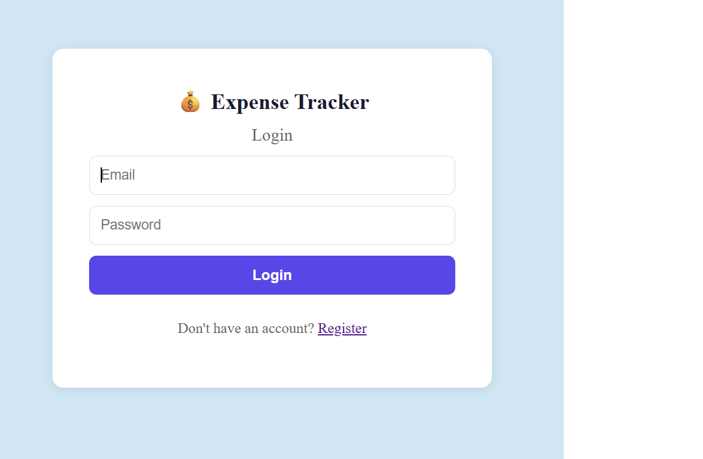
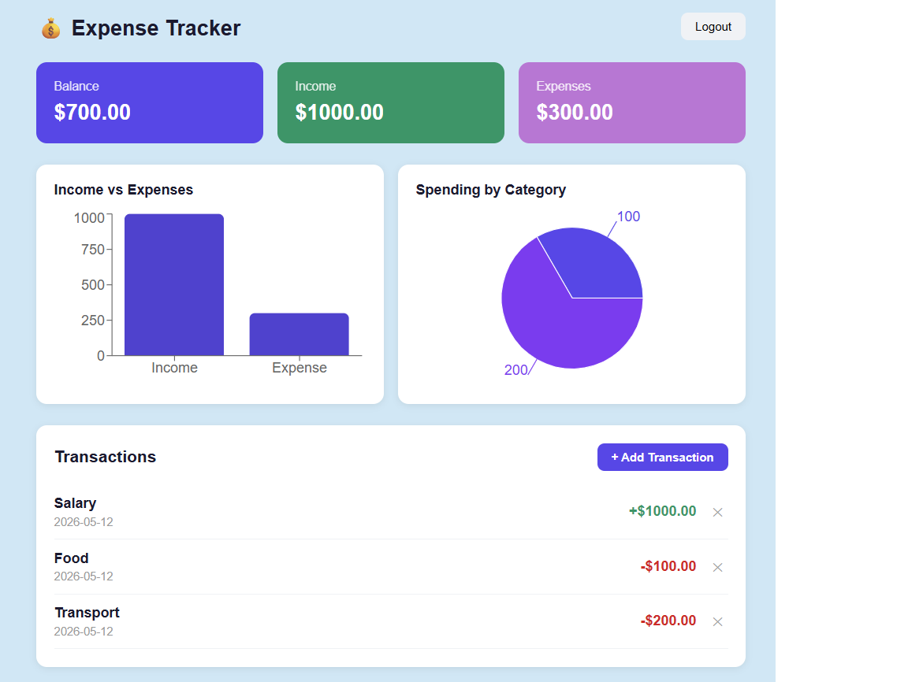

# 💰 Expense Tracker

A full stack web application to track personal income and expenses with real-time charts and analytics.

## 📸 Screenshots



## ✨ Features

- User registration and login with JWT authentication
- Add, view, and delete income and expense transactions
- Real-time balance calculation (Income - Expenses)
- Interactive bar chart — Income vs Expenses
- Pie chart — Spending breakdown by category
- Color coded transactions (green = income, red = expense)
- Fully responsive design

## 🛠️ Tech Stack

**Frontend:**
- React.js
- Recharts (data visualization)
- React Router DOM
- Axios

**Backend:**
- Python
- FastAPI
- SQLAlchemy ORM
- JWT Authentication (python-jose)
- Passlib + Bcrypt (password hashing)

**Database:**
- SQLite (local development)

## 🚀 Getting Started

### Prerequisites
- Python 3.12.8
- Node.js 20.x
- npm 10.x

### 1. Clone the repository
```bash
git clone https://github.com/PaakhiKataria/expense-tracker.git
cd expense-tracker
```

### 2. Backend Setup
```bash
cd backend
python -m venv venv
venv\Scripts\activate
# Option 1: Install from requirements.txt
pip install -r requirements.txt
# Option 2: Install manually
pip install fastapi uvicorn sqlalchemy python-jose passlib bcrypt==4.0.1 python-multipart
uvicorn main:app --reload
```

Backend runs on: `http://127.0.0.1:8000`

API docs available at: `http://127.0.0.1:8000/docs`

### 3. Frontend Setup
```bash
cd frontend
npm install
npm run dev
```

Frontend runs on: `http://localhost:5173`

## 📁 Project Structure

```
expense-tracker/
├── backend/
│   ├── main.py              ← FastAPI app entry point
│   ├── database.py          ← Database connection
│   ├── models.py            ← SQLAlchemy models
│   ├── schemas.py           ← Pydantic schemas
│   └── routes/
│       ├── auth.py          ← Register & Login endpoints
│       └── transactions.py  ← Transaction CRUD endpoints
├── frontend/
│   └── src/
│       ├── pages/
│       │   ├── Login.jsx        ← Login page
│       │   ├── Register.jsx     ← Register page
│       │   └── Dashboard.jsx    ← Main dashboard with charts
│       └── api/
│           └── axios.js         ← API configuration
└── README.md
```

## 🔌 API Endpoints

| Method | Endpoint | Description |
|--------|----------|-------------|
| POST | /auth/register | Register a new user |
| POST | /auth/login | Login and get JWT token |
| GET | /transactions/ | Get all transactions |
| POST | /transactions/ | Add a new transaction |
| PUT | /transactions/{id} | Update a transaction |
| DELETE | /transactions/{id} | Delete a transaction |
| GET | /transactions/summary | Get totals and chart data |

## 💡 How It Works

1. User registers and logs in
2. JWT token is stored in localStorage
3. Every API request sends the token in the Authorization header
4. Backend verifies the token and returns only that user's data
5. Dashboard fetches transactions and summary on load
6. Charts update automatically when transactions are added or deleted

## 👩‍💻 Author

Paakhi Kataria
- GitHub: [@PaakhiKataria](https://github.com/PaakhiKataria)